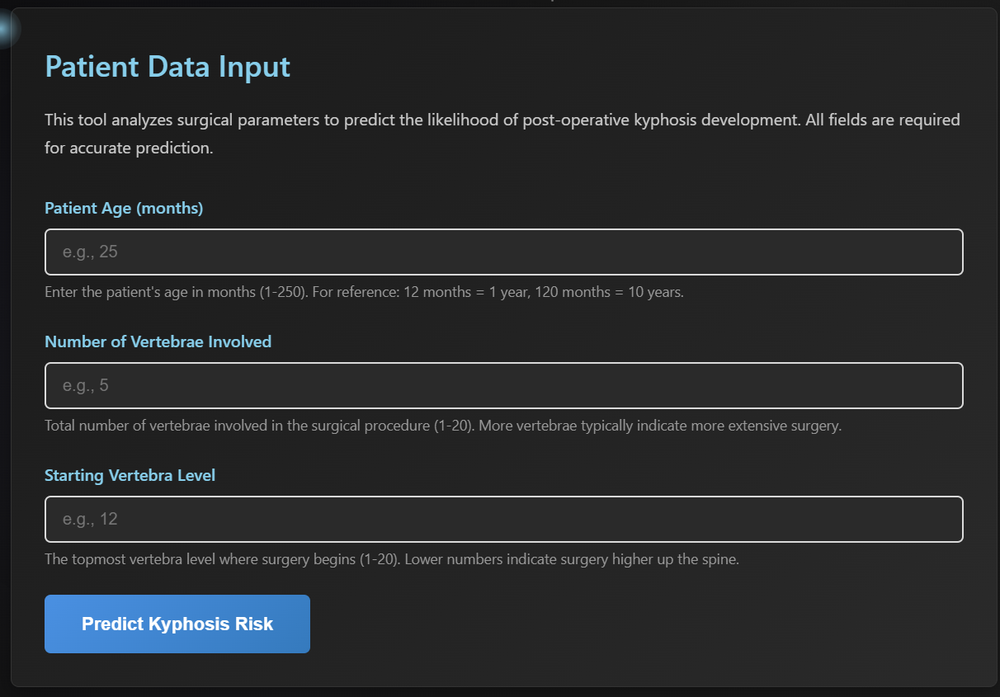

# Spinal Kyphosis Detector Using Machine Learning

A full-stack web application that uses machine learning to help identify the likelihood of kyphosis based on three key clinical inputs. The project combines a FastAPI backend with a simple front-end experience to make the prediction process easy to understand and demonstrate.

> ⚠️ Medical Disclaimer: This application is for educational and demonstration purposes only. It should not be used for actual medical diagnosis or treatment decisions. Always consult a qualified healthcare professional for medical advice.

---

## Why This Project Matters

Kyphosis is a spinal condition in which the spine curves abnormally, often creating visible posture changes and, in more serious cases, pain, breathing issues, or reduced mobility. It can affect children, adolescents, and adults, and early detection is important because treatment outcomes are often better when the condition is identified early.

In the real world, one of the biggest challenges is that kyphosis may not always be obvious at first glance, and diagnosis often depends on clinical assessment, imaging, and specialist review. This makes it an important problem for health technology, education, and decision support systems.

Our project aims to show how machine learning can support awareness and preliminary screening by analyzing a small set of structured features that are often available in medical records.


---

## Our Solution Approach

This project builds a simple predictive model that learns from historical medical-style data and predicts whether kyphosis is present or absent. The solution is designed to be:

- Easy to understand for students and beginners
- Lightweight and fast to run
- Suitable for a web-based demonstration
- Focused on clear explainability rather than complex clinical deployment

The system uses a decision tree classifier trained on the available dataset and exposes the prediction through a small web interface.

---

## How the Analysis Works

The analysis is based on three main components:

1. Age
   - Age is an important factor because spinal development and structural changes often vary significantly with age.
   - This helps the model understand whether the patient profile is more consistent with kyphosis or a normal spinal pattern.

2. Number of Vertebrae Involved
   - This refers to how many vertebrae are involved in the surgical or structural condition being considered.
   - A higher number may indicate a more severe or widespread pattern.

3. Starting Vertebrae Level
   - This represents the topmost vertebra level involved in the condition.
   - The location of the starting point can strongly affect how the curvature develops and is therefore useful for prediction.

These three features form the core of the analysis and are used by the model to make a prediction.



---

## Model Accuracy

The model is trained using a decision tree classifier on a structured dataset with the three input features mentioned above. The training pipeline evaluates the model on a held-out test set, and the current implementation is designed to provide approximately 82% accuracy in this setup.

This makes the project a strong educational example of how machine learning can be used in a medical-inspired prediction problem, while also keeping the scope practical and understandable.

---

## Project Structure

```text
spinal-kyphosis-detector-using-machine-learning/
├── backend/
│   ├── main.py
│   ├── requirements.txt
│   └── train_model.py
├── Dataset/
│   └── kyphosis.csv
├── frontend/
│   ├── about.html
│   ├── index.html
│   ├── predict.html
│   ├── script.js
│   ├── style.css
│   └── assets/
└── README.md
```

---

## Quick Start

### Prerequisites
- Python 3.8+
- pip
- A modern web browser

### 1. Clone the repository
```bash
git clone <repository-url>
cd spinal-kyphosis-detector-using-machine-learning
```

### 2. Install backend dependencies
```bash
cd backend
pip install -r requirements.txt
```

### 3. Train the model
```bash
python train_model.py
```

### 4. Start the backend server
```bash
uvicorn main:app --reload --port 8000
```

### 5. Open the frontend
```bash
cd ../frontend
python -m http.server 3000
```

Then open: http://localhost:3000/index.html

---

## Features of the App

- Educational home page explaining kyphosis
- Prediction page for entering age, number of vertebrae, and start level
- About page showing the project concept and model performance
- Simple web-based interface with a medical-themed design

---

## API Reference

| Endpoint | Method | Description |
|---|---|---|
| /health | GET | Server health check |
| /predict | POST | Returns a prediction result |
| /metrics | GET | Returns model-related metrics |

---

## Tech Stack

- Backend: Python, FastAPI, scikit-learn, pandas, joblib
- Frontend: HTML, CSS, JavaScript
- Model: Decision Tree Classifier

---

## License

This project is intended for educational and demonstration purposes only.

---

Built for learning, experimentation, and awareness about kyphosis detection through machine learning.